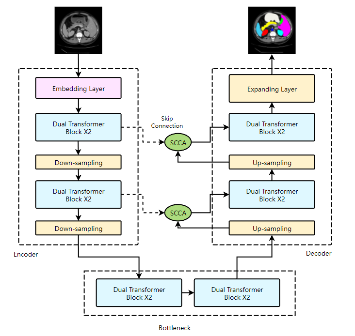

# [HSA-Unet: Dual AttenHybrid Scale Attention Unet for Medical Images Segmentation](https://www.baidu.com)

 Medical image segmentation poses challenges in capturing both local and global context infor
mation effectively. While Convolutional Neural Networks (CNNs) and non-local attention methods
 have advanced this field, they struggle with either capturing long-range dependencies or managing
 computational complexities. In response, this paper introduces the Hybrid Scale Attention (HSA)
 model, which combines local and global attention mechanisms to enhance feature representation
 and segmentation performance. The HSA model comprises three main components: a hybrid lo
cal attention encoder for multiscale feature extraction, a global attention bottleneck to integrate
 global features, and a hybrid local attention decoder for feature fusion and mask generation. We
 employ a novel loss function tailored for medical segmentation, ensuring both simplicity and effi
ciency. We evaluated our model on two medical image segmentation datasets: Synapse and skin
 lesion segmentation. Evaluation on Synapse and skin lesion segmentation datasets demonstrates
 the HSA model’s superiority over state-of-the-art methods, achieving Dice scores of 0.80 and 0.93,
 respectively. Ablation studies and visualization analyses confirm the model’s effectiveness and
 interpretability. Our work introduces a powerful transformer-based approach to medical image
 segmentation.



## Updates


## Citation
```
@article{hsa-unet,
  title={HSA-Unet: Dual AttenHybrid Scale Attention Unet for Medical Images Segmentation},
  author={Yong Chen, Yangming Luo},
  journal={arXiv preprint arXiv:2212.13504},
  year={2024}
}
```

## How to use

The script train.py contains all the necessary steps for training the network. A list and dataloader for the Synapse dataset are also included.
To load a network, use the --module argument when running the train script (``--module <directory>.<module_name>.<class_name>``, e.g. ``--module networks.DAEFormer.DAEFormer``)


### Model weights
You can download the learned weights of the DAEFormer in the following table. 

Task | Dataset |Learned weights
------------ | -------------|----
Multi organ segmentation | [Synapse](https://drive.google.com/uc?export=download&id=18I9JHH_i0uuEDg-N6d7bfMdf7Ut6bhBi) | [DAE-Former](https://drive.google.com/u/0/uc?id=1JEnicYtcMbU_PD_ujCPMaOH5_cs56EIO&export=download)


### Training and Testing

1) Download the Synapse dataset from [here](https://drive.google.com/uc?export=download&id=18I9JHH_i0uuEDg-N6d7bfMdf7Ut6bhBi).

2) Run the following code to install the Requirements.

    `pip install -r requirements.txt`

3) Run the below code to train the DAEFormer on the synapse dataset.
    ```bash
    python train.py --root_path ./data/Synapse/train_npz --test_path ./data/Synapse/test_vol_h5 --batch_size 20 --eval_interval 20 --max_epochs 400 --module networks.DAEFormer.DAEFormer
    ```
    **--root_path**     [Train data path]

    **--test_path**     [Test data path]

    **--eval_interval** [Evaluation epoch]

    **--module**        [Module name, including path (can also train your own models)]
    
 4) Run the below code to test the DAEFormer on the synapse dataset.
    ```bash
    python test.py --volume_path ./data/Synapse/ --output_dir './model_out'
    ```
    **--volume_path**   [Root dir of the test data]
        
    **--output_dir**    [Directory of your learned weights]
    
## Results
Performance comparision on Synapse Multi-Organ Segmentation dataset.


### Query
All implementation done by Rene Arimond. For any query please contact us for more information.

```python
rene.arimond@lfb.rwth-aachen.de

```
